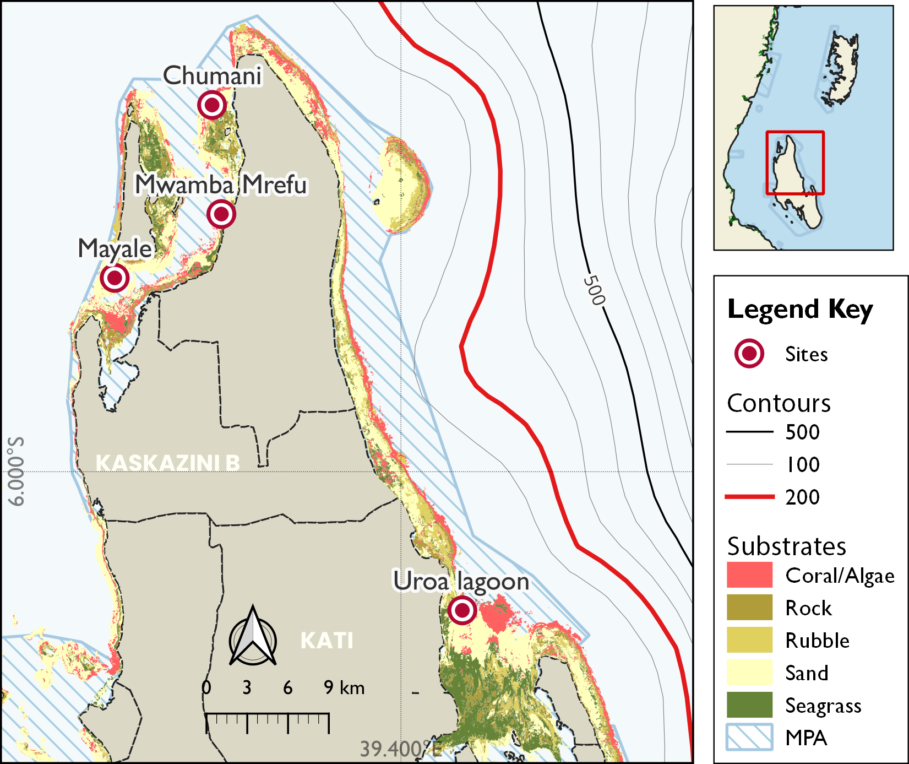
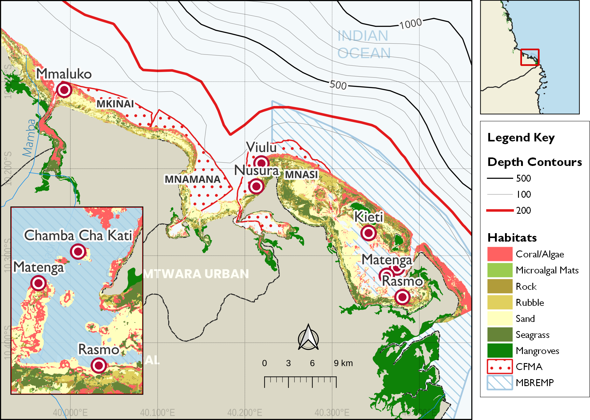

\pagenumbering{roman}

# Executive Summary {.unnumbered}

This report presents the findings of a baseline ecological survey conducted in March 2026 across seven coral reef sites in Unguja North and Mtwara, Tanzania. The assessment utilized four key metrics: benthic substrate composition, fish biomass, coral recruit density, and indicator invertebrate assemblages to evaluate reef health and prioritize restoration efforts under the *Bahari Yetu* project.

Key findings indicate that **Mnazi Bay** (Mtwara) remains the healthiest site, exhibiting the highest hard coral cover (51.3%) and fish biomass (634.1 kg/ha). Conversely, **Mngoji** and **Kendwa** were identified as critically degraded, characterized by high algal dominance and low recruitment, signaling an urgent need for active restoration. The study confirms that Marine Managed Areas (MMAs) generally support higher biodiversity and biomass, though community-led governance at sites like **Jongowe** also shows significant ecological resilience.

Restoration priorities are categorized into immediate, moderate, and maintenance tiers, with recommendations including coral gardening, macroalgae removal, and the strengthening of local governance frameworks to ensure long-term sustainability of Tanzania's marine assets.

# Acknowledgments {.unnumbered}

The authors wish to express their gratitude to the following individuals and organizations for their invaluable contributions to this assessment:

- **Local Government & Authorities:** Habiba (Fisheries Officer, Mtwara DC) and the representatives from the District Administrative Secretary (DAS) office for their guidance on the relevance of marine assets to the blue economy.
- **MBREMP:** Redfred Ngowo, Davis Ulio, Mustafa, Musa, and the entire team for their logistical support and ecological expertise.
- **Technical Partners:** The Nature Conservancy (TNC) team (Senkondo, Emma, and Glory), Wildlife Conservation Society (WCS) (Pagu), and the Nelson Mandela African Institution of Science and Technology (NM-AIST) (Semba) for data collection and technical analysis.
- **Community Members:** Participants from the villages of Msangamkuu, Rivula, Msimbati, Mngoji, Mnazi, and Nalingu, whose local knowledge and commitment to *Bahari Yetu* are central to the success of these conservation efforts. Note: While initially planned, the village of Mgao was not surveyed due to tidal constraints.


# Glossary of Terms {.unnumbered}


| Term | Definition |
|------|------------|
| **CCA** | Crustose Coralline Algae --- calcified red algae that facilitate coral larval settlement |
| **MMA** | Marine Managed Area --- a broadly defined zone with regulated marine resource use |
| **MPA** | Marine Protected Area --- a zone with regulated or prohibited extractive use |
| **PIT** | Point-Intercept Transect --- a standardised benthic survey methodology |
| **UVC** | Underwater Visual Census --- a standardised fish survey methodology |
| **WIO** | Western Indian Ocean --- the biogeographic region encompassing Tanzania's marine environment |
| **Phase shift** | Ecological transition from a coral-dominated to an algae-dominated reef state |
| **Recruit** | Juvenile coral colony with a maximum diameter of 5 cm or less |
| **Trophic group** | Functional feeding category used to classify fish assemblages |
| **Allometric** | Relating to the non-proportional growth relationship used in biomass estimation |


\pagenumbering{arabic}

```{r}
#| label: setup
#| include: false

library(tidyverse)
library(knitr)
library(kableExtra)
library(ggplot2)
library(sf)
library(patchwork)
require(tidyplots)
require(scales)
library(ggspatial)
library(ggrepel)
require(gt)

# Colour palette (consistent across all figures)
site_colours <- c(
  "Fukuchani"   = "#1B7837",
  "Uroa"        = "#5AAE61",
  "Jongowe"     = "#ACD39E",
  "Kendwa"      = "#A6D96A",
  "Mnazi Bay"   = "#762A83",
  "Msangamkuu"  = "#AF7DB8",
  "Mgano"       = "#C2A5CF"
)
region_colours <- c("Unguja North" = "#1B7837", "Mtwara" = "#762A83")

# -----------------------------------------------------------------------
# PLACEHOLDER DATA - replace all values with actual field data
# -----------------------------------------------------------------------

substrate_data <- tibble(
  region   = c(rep("Unguja North", 16), rep("Mtwara", 12)),
  site     = c(rep("Fukuchani", 4), rep("Uroa", 4),
               rep("Jongowe", 4),  rep("Kendwa", 4),
               rep("Mnazi Bay", 4), rep("Msanga Mkuu", 4), rep("Mgano", 4)),
  category = rep(c("Hard Coral", "Soft Coral", "Algae", "Rubble/Other"), 7),
  cover_pct = c(
    38.2, 5.1, 22.4, 34.3,   # Fukuchani
    29.7, 4.8, 31.5, 34.0,   # Uroa
    42.1, 6.3, 18.9, 32.7,   # Jongowe
    24.5, 3.9, 38.7, 32.9,   # Kendwa
    51.3, 7.2, 15.4, 26.1,   # Mnazi Bay
    35.8, 5.5, 27.3, 31.4,   # Msangamkuu
    21.4, 4.1, 41.2, 33.3    # Mgano
  ),
  mma = c(rep(TRUE, 8), rep(FALSE, 8), rep(TRUE, 4), rep(FALSE, 8))
)

fish_data <- tibble(
  region  = c(rep("Unguja North", 4), rep("Mtwara", 3)),
  site    = c("Fukuchani", "Uroa", "Jongowe", "Kendwa",
              "Mnazi Bay", "Msangamkuu", "Mgano"),
  biomass = c(312.4, 198.6, 421.8, 145.2, 634.1, 289.5, 112.3),
  se      = c(48.2,  31.5,  62.4,  24.1,  87.3,  41.2,  18.9),
  mma     = c(TRUE, TRUE, FALSE, FALSE, TRUE, FALSE, FALSE)
)

recruit_data <- tibble(
  region  = c(rep("Unguja North", 4), rep("Mtwara", 3)),
  site    = c("Fukuchani", "Uroa", "Jongowe", "Kendwa",
              "Mnazi Bay", "Msangamkuu", "Mgano"),
  density = c(2.8, 1.4, 3.6, 0.9, 5.2, 2.1, 0.6),
  se      = c(0.42, 0.28, 0.51, 0.19, 0.73, 0.34, 0.14),
  mma     = c(TRUE, TRUE, FALSE, FALSE, TRUE, FALSE, FALSE)
)

invert_data <- tibble(
  region  = c(rep("Unguja North", 12), rep("Mtwara", 9)),
  site    = c(rep("Fukuchani", 3), rep("Uroa", 3),
              rep("Jongowe", 3),  rep("Kendwa", 3),
              rep("Mnazi Bay", 3), rep("Msangamkuu", 3), rep("Mgano", 3)),
  taxon   = rep(c("Sea Urchins", "Sea Cucumbers", "Giant Clams"), 7),
  density = c(
    12.4, 3.2, 1.8,
     9.1, 2.7, 0.9,
    15.3, 4.1, 2.4,
     6.8, 1.2, 0.4,
    18.9, 6.8, 3.7,
    11.2, 3.4, 1.5,
     5.4, 0.8, 0.2
  ),
  mma = c(rep(TRUE, 6), rep(FALSE, 6), rep(TRUE, 3), rep(FALSE, 6))
)

site_summary <- tibble(
  Region   = c(rep("Unguja North", 4), rep("Mtwara", 3)),
  Site     = c("Fukuchani", "Uroa", "Jongowe", "Kendwa",
               "Mnazi Bay", "Msangamkuu", "Mgano"),
  `MMA Status`             = c("Inside", "Inside", "Outside", "Outside",
                                "Inside", "Outside", "Outside"),
  `Hard Coral Cover (%)`   = c(38.2, 29.7, 42.1, 24.5, 51.3, 35.8, 21.4),
  `Fish Biomass (kg/ha)`   = c(312.4, 198.6, 421.8, 145.2, 634.1, 289.5, 112.3),
  `Recruit Density (m-2)`  = c(2.8, 1.4, 3.6, 0.9, 5.2, 2.1, 0.6),
  `Sea Urchin Dens. (100 m-2)` = c(12.4, 9.1, 15.3, 6.8, 18.9, 11.2, 5.4)
)
```


```{r}
be_ung = readxl::read_excel('data/TNC Data_Unguja/Unguja coral survey_March 17th -20th 2026.xlsx', sheet = 'Benthic substrate ') |> 
  janitor::clean_names()
```


```{r}
be_ung = be_ung |>
  mutate(
    major_category = case_when(
      substrate_category == 'Live hard coral' ~ 'Hard Coral',
      substrate_category == 'Soft coral' ~ 'Soft Coral',
      substrate_category == 'Turf algae' ~ 'Algae',
      substrate_category == 'Macroalgae' ~ 'Algae',
      substrate_category == 'Coraline algae' ~ 'Algae',
      substrate_category == 'Seagrass' ~ 'Seagrass',
      substrate_category %in% c('Rubble', 'Sand', 'Dead coral', 'Sponge', 'Bare rock') ~ 'Rubble/Others'
    ), .after = substrate_category
  ) |> 
  mutate(site = str_replace_all(site, 'Uroa lagoon', 'Chama Kangu'))


```


```{r}
be_mt = readxl::read_excel('data/TNC Data_Mtwara/master.xlsx', sheet = 'benthic_substrate')

be_mt = be_mt |> 
  pivot_longer(cols = 14:22, names_to = 'substrate_category', values_to = 'pct_cover')  |> 
  janitor::clean_names()

# be_mt |> distinct(substrate_category) |> pull()
```


```{r}
be_mt = be_mt |>
  mutate(
    major_category = case_when(
      substrate_category == 'Hard Coral' ~ 'Hard Coral',
      substrate_category == 'Soft coral' ~ 'Soft Coral',
      substrate_category == 'Fleshy algae' ~ 'Algae',
      substrate_category == 'Algal Turf' ~ 'Algae',
      substrate_category == 'Calcareous' ~ 'Algae',
      substrate_category == 'Coralline' ~ 'Algae',
      substrate_category == 'Seagrass' ~ 'Seagrass',
      substrate_category %in% c('Sand', 'Sponge') ~ 'Rubble/Others'
    ), .after = substrate_category
  )


```

# Introduction {#sec-intro}

\index{coral reef!ecology}
\index{Tanzania!coral reefs}

Coral reefs are among the most productive and biodiverse ecosystems on Earth, supporting approximately one quarter of all marine species and providing critical ecosystem services --- including food security, coastal protection, and tourism revenue --- to hundreds of millions of people globally [@wilkinson2008status; @burke2011reefs]. In the Western Indian Ocean (WIO), coral reefs are particularly important, sustaining the livelihoods of coastal communities that depend heavily on artisanal fisheries and reef-based tourism [@obura2017reef].

Tanzania's coral reefs span the mainland coast and the islands of Zanzibar (Unguja and Pemba), forming part of the broader East African Coral Reef system ---  one of the world's most significant reef complexes [@mcclanahan2014management]. Despite their ecological and socioeconomic value, Tanzanian reefs have experienced considerable decline over recent decades, driven by a combination of anthropogenic stressors including destructive fishing practices, coastal eutrophication, sedimentation, and the compounding effects of climate-driven coral bleaching events [@obura2016coral; @mcclanahan2020global].

\index{marine managed areas (MMAs)}

Marine Managed Areas (MMAs) have been established across Tanzania as a principal governance tool for coral reef conservation, encompassing both no-take zones and partially restricted-use zones [@rocliffe2014towards]. However, the ecological effectiveness of these MMAs varies considerably depending on management capacity, community engagement, and enforcement [@cinner2016bright]. Comparative assessment of reef condition within and outside MMA boundaries therefore provides critical insight into management effectiveness and guides targeted restoration planning.

\index{reef restoration}

This report presents findings from a systematic multi-metric reef health assessment conducted at seven sites across two regions: **Unguja North** (Fukuchani, Uroa, Jongowe, and Kendwa) and **Mtwara** (Mnazi Bay, Msangamkuu, and Mngoji). The assessment evaluated four ecological metrics --- benthic substrate composition, fish biomass, coral recruit density, and invertebrate assemblages --- to: (i) characterise reef condition at each site; (ii) compare condition between MMA and non-MMA sites; and (iii) identify priority areas for active restoration intervention.


# Methodology {#sec-methods}

\index{methodology!field survey}

## Study Area {#sec-studyarea}

\index{Unguja North}
\index{Mtwara}

The ecological assessment was conducted across seven distinct coral reef sites distributed between the northern coast of Unguja Island and the southern mainland region of Mtwara. These sites were strategically selected to represent a gradient of management regimes, including established Marine Managed Areas (MMAs) and open-access reefs. Note that while Mgao was initially selected, it was not surveyed due to unfavorable tidal conditions during the mission. The geographic distribution and spatial orientation of all study sites are illustrated in @fig-map-unguja-north and @fig-map-mbremp, respectively.


```{r}
loc_ung = be_ung |> 
  distinct(longtitude , .keep_all = TRUE) |> 
  mutate(region = 'Unguja North', Management = NA, Exposure = NA) |> 
  select(region, Area = location, Reef = site, Management, Exposure, Latitude = latitude, Longitude = longtitude)

loc_mt = be_mt |> 
  distinct(longitude, .keep_all = TRUE) |> 
  mutate(region = 'Mtwara') |> 
  select(region, Area = site, Reef = location, Management = management, Exposure = exposure, Latitude = latitude, Longitude = longitude)

site_sf = loc_ung |> 
  bind_rows(loc_mt) |> 
  mutate(lon = Longitude, lat = Latitude) |> 
  st_as_sf(coords = c('Longitude', 'Latitude'), crs = 4326) 

# site_sf |> st_write('data/site_locations.gpkg')

```


```{r}
#| label: fig-study-sites
#| fig-cap: "Map of study areas with assessed sites in (A) Unguja North, and (B) Mtwara"
#| fig-pos: H
#| fig-height: 4
#| eval: false
#| 

pm1 = ggplot() +
  geom_sf(data = site_sf |> filter(region == 'Unguja North'), size = 5) +
  ggrepel::geom_label_repel(data = site_sf|> filter(region == 'Unguja North'), aes(x = lon, y = lat, label = Reef),
    size = 3.5, box.padding = 0.95,
    show.legend = FALSE
  ) + labs(title = 'Unguja North')+
    annotation_scale(location = "bl", width_hint = 0.3) +
    # annotation_north_arrow(
    #   location    = "tr",
    #   which_north = "true",
    #   style       = north_arrow_fancy_orienteering(
    #     fill      = c("white", "grey40"),
    #     text_size = 5
    #   )
    # ) +
  scale_x_continuous(breaks = scales::pretty_breaks(n = 2)) +
  theme_minimal(base_size = 12)  +
  theme(
    axis.title = element_blank(),  
    plot.title = element_text(face = "bold")
    )

pm2 = ggplot() +
  geom_sf(data = site_sf |> filter(region == 'Mtwara'), size = 5) +
  ggrepel::geom_label_repel(data = site_sf|> filter(region == 'Mtwara'), aes(x = lon, y = lat, label = Reef),
    size = 3.5, box.padding = 0.95,
    show.legend = FALSE
  ) +
    labs(title = 'Mtwara') +
    annotation_scale(location = "bl", width_hint = 0.3) +
    annotation_north_arrow(
      location    = "tr",
      which_north = "true",
      style       = north_arrow_fancy_orienteering(
        fill      = c("white", "grey40"),
        text_size = 5
      )
    ) +
  theme_minimal(base_size = 12) +
  theme(
    axis.title = element_blank(),  
    plot.title = element_text(face = "bold")
    )

(pm1 | pm2) + plot_annotation(tag_levels = "A")
```


{#fig-map-unguja-north fig-pos="H"}

### Unguja North

Unguja North encompasses the northern coastline of Unguja Island, Zanzibar, characterised by fringing and patch reef systems with relatively shallow reef flats (@fig-map-unguja-north). This area is subject to substantial fishing pressure from surrounding communities. Of the four sites assessed, Fukuchani and Uroa fall within designated MMA boundaries, while Jongowe and Kendwa are located outside formal management areas (see @tbl-unguja-geo).


```{r}
#| label: tbl-unguja-geo
#| tbl-cap: "Geographic coordinates and management status of coral reef survey sites in Unguja North."
#| tbl-pos: H

be_ung |> 
  distinct(longtitude , .keep_all = TRUE) |> 
  mutate( Management = NA, Exposure = NA) |> 
  select(Area = location, Reef = site, Management, Exposure, Latitude = latitude, Longitude = longtitude) |> 
  gt()  |>
  tab_spanner(columns = 5:6, label = "Coordinates") |> 
  cols_width( 
    Area ~ px(100),
    Reef ~ px(150),    
    everything() ~ px(80)
    ) |>
  fmt_number(columns = where(is.numeric), decimals = 5) |>
  fmt_missing(columns = everything(), missing_text = '-') |> 
  # cols_label(substrate_category = "Substrate") |>
  cols_align(align = "center", columns = 5:6)  |>
  tab_options(
    latex.use_longtable = TRUE,
    table.font.size = '10pt', 
    table.align = 'center',
    data_row.padding = px(5),
    column_labels.font.weight = "bold",
    column_labels.background.color = "#004763ff"
  ) 

```

### Mtwara

Mtwara is located in the southernmost coastal region of Tanzania (@fig-map-mbremp), adjacent to the Mozambique border. The Mtwara coastline supports a diverse reef mosaic influenced by the Ruvuma River discharge and seasonal monsoon dynamics. Mnazi Bay --- one of Tanzania's oldest and best-studied marine protected areas --- represents the primary MMA site for this region, while Msangamkuu is situated outside formal management structures (@tbl-mtwara-geo).


```{r}
#| label: tbl-mtwara-geo
#| tbl-cap: "Geographic coordinates and management status of coral reef survey sites in Mtwara region."
#| tbl-pos: H

be_mt |> 
  distinct(longitude, .keep_all = TRUE) |> 
  select(Area = site, Reef = location, Management = management, Exposure = exposure, Latitude = latitude, Longitude = longitude) |> 
  gt()  |>
  tab_spanner(columns = 5:6, label = "Coordinates") |> 
  cols_width( 
    Area ~ px(120),
    Reef ~ px(150),  
    Management ~ px(100),
    everything() ~ px(80)
    ) |>
  fmt_number(columns = where(is.numeric), decimals = 5) |>
  fmt_missing(columns = everything(), missing_text = '-') |> 
  # cols_label(substrate_category = "Substrate") |>
  cols_align(align = "center", columns = 5:6) |>
  tab_options(
    latex.use_longtable = TRUE,
    table.font.size = '10pt', 
    table.align = 'center',
    data_row.padding = px(5),
    column_labels.font.weight = "bold",
    column_labels.background.color = "#004763ff"
  ) 

```

{#fig-map-mbremp fig-pos="H"}

## Survey Design {#sec-surveydesign}

Ecological surveys were conducted between [Month Year] and [Month Year] following standardised reef health monitoring protocols consistent with CORDIO East Africa and the Reef Check methodology [@hodgson2006reef; @wilson2020reef]. Each site was assessed using replicated belt transects at two depth strata (shallow: 3--5 m; deep: 8--12 m), with three replicate transects per stratum per site (n = 6 transects per site).

\index{GPS coordinates}

Site locations were recorded using GPS (plus or minus 3 m accuracy). Transect positions were marked with stainless steel stakes and georeferenced for repeatability in future monitoring rounds.

## Benthic Substrate Assessment {#sec-benthicmethod}

\index{benthic substrate!point-intercept transect}

Benthic cover was estimated using the Point-Intercept Transect (PIT) method [@english1997survey]. Along each 25 m transect tape, substrate category was recorded at 0.5 m intervals (50 points per transect). Substrate categories followed the GCRMN classification scheme:

(i) hard coral, (ii) soft coral, (iii) crustose coralline algae (CCA),
(iv) algae (turf and macroalgae combined), (v) rubble, (vi) sand, and
(vii) other (rock, sponge, etc.). Cover estimates were calculated as
the percentage of points falling within each category.

## Fish Biomass Assessment {#sec-fishmethod}

\index{fish biomass!belt transect}

Fish biomass and density were estimated using underwater visual census (UVC) belt transects (50 m x 5 m). All fish species observed within the belt were identified to family level, counted, and their total length estimated to the nearest centimetre. Fish density was calculated as the number of individuals per unit area (individuals per 100 m^2^). Biomass (kg/ha) was calculated from length-weight relationships derived from FishBase [@froese2023fishbase], applying species-specific allometric parameters:

$$
D = \frac{N}{A} \times 100
$$

where $D$ is density, $N$ is the count of individuals, and $A$ is the sampled area (250 m^2^).

$$
W = a \cdot L^{b}
$$

where $W$ is weight (g), $L$ is total length (cm), and $a$ and $b$ are species-specific constants. Fish assemblages were characterised by trophic group (herbivores, piscivores, invertivores, and omnivores).

```{r}
fish_mt = readxl::read_excel('data/TNC Data_Mtwara/master.xlsx', sheet = 'fish') |> 
  janitor::clean_names()

fish_density = fish_mt |> 
  select(site, reef = location,family:x80) |> 
  mutate(area_m2 = 50*5, .before = family) |> 
  rowwise() |> 
  mutate(total_count = sum(c_across(starts_with("x")), na.rm = TRUE)) |> 
  mutate(density_100m2 = (total_count / area_m2) * 100)
```

## Coral Recruit Assessment {#sec-recruitmethod}

\index{coral recruits!juvenile density}

Coral recruit density was assessed using 1 m^2^ quadrats placed at 1 m intervals along each transect (25 quadrats per transect). All coral recruits less than or equal to 5 cm maximum diameter were counted and identified to genus level where possible [@babcock1992coral]. Recruit density is expressed as recruits 100 m^-2^.


```{r}
recruit_mt = readxl::read_excel('data/TNC Data_Mtwara/master.xlsx', sheet = 'Recruits') |> 
  janitor::clean_names()

recruit_density = recruit_mt |> 
  select(site, reef = location,genus:x7_5_10) |> 
  mutate(area_m2 = 1*1, .before = genus) |> 
  rowwise() |> 
  mutate(total_count = sum(c_across(starts_with("x")), na.rm = TRUE)) |> 
  mutate(density_100m2 = (total_count / area_m2) * 100)
```

## Invertebrate Assessment {#sec-invertmethod}

\index{invertebrates!survey}

Key indicator invertebrates were counted within 25 m x 2 m belt transects. Target taxa included: 

(i) sea urchins (*Diadema* spp., *Echinometra* spp., and *Tripneustes* spp.); 
(ii) sea cucumbers (*Holothuria* spp., *Thelenota* spp., and *Actinopyga* spp.); and 
(iii) giant clams (*Tridacna* spp.). 

Density is expressed as individuals per 100 m^2^.


```{r}
invert_mt = readxl::read_excel('data/TNC Data_Mtwara/master.xlsx', sheet = 'Invertebrates')

invert_density = invert_mt |> 
  select(Site, reef = Location, Urchin:COTs) |> 
  pivot_longer(cols = Urchin:COTs, names_to = 'genus', values_to = 'total_count') |> 
   mutate(area_m2 = 1*1, .before = genus) |> 
   mutate(total_count = na_if(total_count, 0)) |> 
  mutate(density_100m2 = (total_count / area_m2) * 100) 

```

## Data Analysis {#sec-dataanalysis}

All data were analysed in R (v4.5.0; @rcoreteam2024). Site-level metrics are summarised as means +/- standard error (SE). Differences in reef metrics between MMA and non-MMA sites were assessed using Welch's *t*-tests. Figures were produced using the **ggplot2** package [@wickham2016ggplot2], maps using the **sf** package [@pebesma2018sf], and tables formatted using **kableExtra** [@zhu2024kableextra]. A significance threshold of alpha = 0.05 was applied throughout.

\newpage

# Results {#sec-results}

## Unguja North {#sec-unguja}

\index{Unguja North!results}


### Benthic Substrate Composition {#sec-unguja-substrate}

\index{benthic substrate!Unguja North}


Benthic substrate composition varied considerably among the four Unguja North sites (@tbl-substrate-unguja). Live hard coral cover was highest at Jongowe (26.2%) and Kendwa (23.8%), while the MMA sites, Fukuchani and Uroa, recorded significantly lower hard coral cover at 8.8% and 5.0% respectively. Algal dominance was most pronounced at Uroa, with macroalgae (41.2%) and turf algae (35.0%) constituting the majority of the benthos, indicating a severe phase shift. Fukuchani also exhibited high macroalgal cover (32.5%), though it supported considerable soft coral communities (20.0%). Contrary to general expectations, the sites outside the MMA (Jongowe and Kendwa) displayed higher hard coral cover than those within the managed area, although Jongowe was characterised by extensive sand cover (46.2%). The major category are shown in @fig-substrate-unguja

```{r}
#| label: tbl-substrate-unguja
#| tbl-cap: Percentage cover of benthic substrate across survey locations in Unguja North
#| tbl-pos: H

be_ung |>
  group_by(site, substrate_category) |>
  summarise(n = n()) |>
  mutate(pct = n * 100 / sum(n)) |>
  ungroup() |>
  select(-n) |>
  pivot_wider(names_from = site, values_from = pct) |>
  arrange(desc(Mayale)) |> 
  gt() |>
  tab_spanner(columns = -1, label = "Percentage Cover") |> 
  cols_width( 
    substrate_category ~ px(160),
    Chumani ~ px(80),
    Mayale ~ px(80),    
    everything() ~ px(140)
    ) |>
  fmt_number(columns = where(is.numeric), decimals = 1) |>
  fmt_missing(columns = everything(), missing_text = '-') |> 
  cols_label(substrate_category = "Substrate") |>
  cols_align(align = "center", columns = 2:5) |>
  tab_options(
    latex.use_longtable = TRUE,
    table.font.size = '12pt', 
    table.align = 'center',
    data_row.padding = px(5),
    column_labels.font.weight = "bold"
  ) |> 
  data_color(
    columns = -1, 
    palette = 'Reds', 
    na_color = 'grey80',
    direction = 'column', 
    method = 'factor'
    )

```


```{r}
#| label: fig-substrate-unguja
#| fig-cap: "Major benthic substrate composition (% cover) at the four Unguja North sites."
#| fig-height: 3.5
#| fig-pos: H


be_ung |>
  group_by(site, major_category) |>
  summarise(n = n()) |>
  mutate(
    pct = n * 100 / sum(n),
    site = fct_inorder(site)
    ) |>
  tidyplot(x = site, y = pct, fill = major_category) |> 
  add_barstack_absolute() |> 
  adjust_colors(new_colors = c(
      "Seagrass"   = "#1B7837",
      "Hard Coral"   = "#dc1021ff",
      "Soft Coral"   = "#7FBF7B",
      "Algae"        = "#D8B365",
      "Rubble/Others" = "#C7C7C7"
    )) |> 
  adjust_font(fontsize = 10) |> 
  adjust_size(width = 3.8, height = 3, unit = 'in') |> 
  adjust_legend_position(position = 'right') |> 
  tidyplots::adjust_y_axis(
    title = 'Percentage Cover',
    breaks = seq(20,100,20)
    ) |> 
  remove_x_axis_title() |> 
  remove_legend_title()

# be_ung |>
#   group_by(site, major_category) |>
#   summarise(n = n()) |>
#   mutate(
#     pct = n * 100 / sum(n),
#     site = fct_inorder(site)
#     ) |>
#   ungroup() |> 
#   ggplot(aes(x = site, y = pct, fill = major_category)) +
#   geom_col(position = "stack", width = 0.7,
#            colour = "white", linewidth = 0.3) +
#   scale_fill_manual(
    # values = c(
    #   "Seagrass"   = "#1B7837",
    #   "Hard Coral"   = "#dc1021ff",
    #   "Soft Coral"   = "#7FBF7B",
    #   "Algae"        = "#D8B365",
    #   "Rubble/Others" = "#C7C7C7"
    # )
#   ) +
#   scale_y_continuous(expand = c(0, 0), limits = c(0, 105)) +
#   labs(
#     x       = NULL,
#     y       = "Percentage Cover",
#     fill    = "Substrate \nCategory"
#     # caption = "* = site within a Marine Managed Area (MMA)"
#   ) +
#   theme_minimal(base_size = 12) +
#   theme(
#     legend.position    = "right",
#     panel.grid.major.x = element_blank()
#   )


```


### Fish Biomass {#sec-unguja-fish}

\index{fish biomass!Unguja North}

Fish biomass ranged from 145.2 kg/ha at Kendwa to 421.8 kg/ha at Jongowe (see @fig-fish-biomass, panel A). This pattern is noteworthy in that Jongowe, a non-MMA site, recorded the highest biomass in the region --- likely reflecting community-led informal fishing gear restrictions or high reef structural complexity supporting larger predatory species. Kendwa recorded the lowest biomass across the region and, in combination with high algal cover, suggests chronic degradation. MMA sites (Fukuchani: 312.4 kg/ha; Uroa: 198.6 kg/ha) showed intermediate biomass. Uroa fell below the 200 kg/ha depletion threshold, signalling concern even within the MMA boundary.


```{r}
fish_ung = readxl::read_excel('data/TNC Data_Unguja/Unguja coral survey_March 17th -20th 2026.xlsx', sheet = 'Fish_TIDY') |> 
  janitor::clean_names()

# fish_ung |> glimpse()

## since the fish biomass column does not have the reef, we remap  using the benthic substrate
fish_ung = fish_ung |> 
  left_join(
be_ung |> 
  distinct(location,site) |> 
  rename(site = location, reef = site)
  ) |> 
  relocate(reef, .after = site)
```

```{r}
fish_density_ung = fish_ung |> 
  select(site, reef,family, starts_with("x")) |> 
  mutate(
    area_m2 = 50*5, .before = family,
    x3_10_cm = as.integer(x3_10_cm),
    x11_20_cm = as.integer(x11_20_cm),
    x21_30_cm = as.integer(x21_30_cm),
     x31_40_cm  = as.integer( x31_40_cm ),
    x41_50_cm = as.integer(x41_50_cm),
    x51_cm  = as.integer(x51_cm )
    ) |> 
  rowwise() |> 
  mutate(total_count = sum(c_across(starts_with("x")), na.rm = TRUE)) |> 
  mutate(density_100m2 = (total_count / area_m2) * 100)


```


```{r}
#| label: tbl-fish-density-unguja
#| tbl-cap: "Median fish density (individuals per 100 m^2^) by family across the surveyed reefs in Unguja North."
#| tbl-pos: H

fish_density_ung |> 
  filter(density_100m2 > 0) |> 
  group_by(reef, family) |> 
  summarise(density_100m2 = median(density_100m2)) |> 
  ungroup() |> 
  pivot_wider(names_from = reef, values_from = density_100m2) |> 
  arrange(desc(`Chama Kangu`)) |> 
  gt() |>
  tab_spanner(columns = -1, label = md('Fish Density (individuals per 100m^2^)')) |> 
  cols_width( 
    family ~ px(150),
    `Chama Kangu` ~ px(150),
    `Mwamba Mrefu` ~ px(150),
    everything() ~ px(100)
    ) |> 
  fmt_number(columns = where(is.numeric), decimals = 1) |>
  fmt_missing(columns = everything(), missing_text = '-') |> 
  cols_label(family = "Family") |>
  cols_align(align = "center", columns = -1) |>
  tab_options(
    latex.use_longtable = TRUE,
    table.font.size = '12pt', 
    table.align = 'center',
    data_row.padding = px(5),
    column_labels.font.weight = "bold",
    column_labels.background.color = "#004763ff"
  ) |> 
  data_color(
    columns = -1, 
    palette = 'Reds', 
    na_color = 'grey80',
    direction = 'column', 
    method = 'factor'
    )
```


```{r}
#| label: fig-fish-density-unguja-error
#| fig-cap: "Median fish density (individuals per 100 m^2^) across the surveyed reefs in Unguja North."
#| fig-pos: H

fish_density_ung |> 
  mutate(reef = as.factor(reef)) |> 
  # filter(density_100m2 > 0 ) |> 
  tidyplot(x = reef, y = density_100m2) |> 
  add_sem_errorbar(width = .15, linewidth = .5) |> 
  # add_ci95_errorbar(width = .15, linewidth = .5) |> 
  add_mean_bar() |>
  # add_data_points_beeswarm() |> 
  adjust_size(width = 4.5, height = 3, unit = 'in') |> 
 adjust_font(fontsize = 10) |> 
 adjust_y_axis(title = 'Fish Density (individuals per 100m^2^')|>  
  reorder_x_axis_labels(c('Chama Kangu','Mwamba Mrefu',  'Mayale', 'Chumani') |> rev()) |> 
  remove_x_axis_title() |> 
  remove_legend_title()

```


### Coral Recruits {#sec-unguja-recruits}

\index{coral recruits!Unguja North}

Recruit density was highest at Jongowe (3.6 recruits m^-2^) and lowest at Kendwa (0.9 recruits m^-2^), consistent with substrate and biomass patterns (see @fig-recruits, panel A). MMA sites showed intermediate values (Fukuchani: 2.8 m^-2^; Uroa: 1.4 m^-2^). Low recruit density at Uroa despite its MMA status may reflect localised sedimentation stress from adjacent agricultural runoff affecting larval settlement conditions.


```{r}
recruit_ung = readxl::read_excel('data/TNC Data_Unguja/Unguja coral survey_March 17th -20th 2026.xlsx', sheet = 'Coral Recruits') |> 
  janitor::clean_names()

# fish_ung |> glimpse()

## since the fish biomass column does not have the reef, we remap  using the benthic substrate
recruit_ung = recruit_ung |> 
  left_join(
be_ung |> 
  distinct(location,site) |> 
  rename(reef = site)
  ) |> 
  relocate(reef, .after = site)
```

```{r}
recruit_ung = recruit_ung |> 
  select(site, reef,family=genus, starts_with("x")) |> 
  # names()
  mutate(
    area_m2 = 1*1, 
    x0_2_5cm = as.integer(x0_2_5cm),
    x2_6_5cm = as.integer(x2_6_5cm),
    x6_10cm = as.integer(x6_10cm),
    ) |> 
  rowwise() |> 
  mutate(total_count = sum(c_across(starts_with("x")), na.rm = TRUE)) |> 
  mutate(density_100m2 = (total_count / area_m2) * 100)


```


```{r}
#| label: tbl-recruit-density-unguja
#| tbl-cap: "Recruit density (individuals per 100 m^2^) by family across the surveyed reefs in Unguja North."
#| tbl-pos: H

recruit_ung |> 
  filter(density_100m2 > 0) |> 
  group_by(reef, family) |> 
  summarise(density_100m2 = median(density_100m2)) |> 
  ungroup() |> 
  pivot_wider(names_from = reef, values_from = density_100m2) |> 
  arrange(desc(`Chama Kangu`)) |> 
  gt() |>
  tab_spanner(columns = -1, label = md('Fish Density (individuals per 100m^2^)')) |> 
  cols_width( 
    family ~ px(150),
    `Chama Kangu` ~ px(150),
    `Mwamba Mrefu` ~ px(150),
    everything() ~ px(100)
    ) |> 
  fmt_number(columns = where(is.numeric), decimals = 1) |>
  fmt_missing(columns = everything(), missing_text = '-') |> 
  cols_label(family = "Family") |>
  cols_align(align = "center", columns = -1) |>
  tab_options(
    latex.use_longtable = TRUE,
    table.font.size = '12pt', 
    table.align = 'center',
    data_row.padding = px(5),
    column_labels.font.weight = "bold",
    column_labels.background.color = "#004763ff"
  ) |> 
  data_color(
    columns = -1, 
    palette = 'Reds', 
    na_color = 'grey80',
    direction = 'column', 
    method = 'factor'
    )
```


```{r}
#| label: fig-recruit-density-unguja-error
#| fig-cap: "Median recruit density (individuals per 100 m^2^) across the surveyed reefs in Unguja North."
#| fig-pos: H

recruit_ung |> 
  mutate(reef = as.factor(reef)) |> 
  tidyplot(x = reef, y = density_100m2) |> 
  add_mean_bar(alpha = 0.4) |>
  add_sem_errorbar(width = .2, linewidth = .8) |> 
  add_data_points_beeswarm(size = 1.2, alpha = 0.6) |> 
  adjust_size(width = 5, height = 3.5, unit = 'in') |> 
 adjust_font(fontsize = 10) |> 
 adjust_y_axis(title = expression(Recruit~Density~(ind.~100*m^-2)))|>  
  reorder_x_axis_labels(c('Mwamba Mrefu',  'Mayale', 'Chumani', 'Chama Kangu') ) |> 
  remove_x_axis_title() |> 
  remove_legend_title()

```


### Invertebrate Assemblages {#sec-unguja-inverts}

\index{invertebrates!Unguja North}

Sea urchin densities were highest at Jongowe (15.3 per 100 m^2^) and Fukuchani (12.4 per 100 m^2^) (see @fig-inverts, panel A). Sea cucumber and giant clam densities were consistently low across all Unguja North sites, reflecting decades of targeted harvesting of these commercially valuable taxa. Kendwa showed the lowest densities across all three invertebrate indicator taxa, consistent with its overall pattern of ecological decline.


```{r}
invert_ung = readxl::read_excel('data/TNC Data_Unguja/Unguja coral survey_March 17th -20th 2026.xlsx', sheet = 'Invertebrates_TIDY') |> 
  janitor::clean_names()

# fish_ung |> glimpse()

## since the fish biomass column does not have the reef, we remap  using the benthic substrate
invert_ung = invert_ung |> 
  left_join(
    be_ung |> 
      distinct(location,site) |> 
      rename(reef = site)
  ) |> 
  relocate(reef, .after = site)


## Functional groups
invert_ung_restoration = invert_ung  |> 
  rename(genus = common_name) |> 
  mutate(restoration_role = case_when(
    genus == "Sea Urchin" ~ "Algal Grazer",
    genus == "sea cucumber " ~ "Nutrient Cycler",
    genus == "Lobster" ~ "Predator",
    genus == "COTs" ~ "Coral Predator (Threat)",
    TRUE ~ "General Invertebrate"
  ))


 invert_ung_restoration = invert_ung_restoration |> 
  select(location, reef, genus, total_count = counts, restoration_role) |> 
  # pivot_longer(cols = Urchin:COTs, names_to = 'genus', values_to = 'total_count') |> 
   mutate(area_m2 = 50*2, .before = genus) |> 
   mutate(total_count = na_if(total_count, 0)) |> 
  mutate(density_100m2 = (total_count / area_m2) * 100) 

```


```{r}
#| eval: true
#| label: tbl-invertebrate-mtwara
#| tbl-cap: "Mean recruit density (individuals per 100 m^2^) by family across the surveyed reefs in Unguja. Values represent the median density observed across all transects per site."
#| tbl-pos: H

invert_ung_restoration |> 
  select(location, reef, family = genus, density_100m2) |> 
  # mutate(density_100m2 = na_if(density_100m2, 0)) |> 
filter(density_100m2 > 0) |> 
  group_by(reef, family) |> 
  summarise(
    density_mean = median(density_100m2, na.rm = TRUE)
    # density_sd = sd(density_100m2, na.rm = TRUE)
    ) |> 
  ungroup() |> 
  pivot_wider(names_from = reef, values_from = density_mean) |> 
  arrange(desc(`Chumani`)) |> 
  # flextable::flextable() |> 
  gt() |>
  tab_spanner(columns = -1, label = md('Fish Density (individuals per 100m^2^)'))  |> 
  cols_width( 
    family ~ px(150),
    `Chama Kangu` ~ px(150),
     `Mwamba Mrefu` ~ px(150),
    everything() ~ px(70)
    ) |> 
  fmt_number(columns = where(is.numeric), decimals = 0) |>
  fmt_missing(columns = everything(), missing_text = '-') |> 
  cols_label(family = "Family") |>
  cols_align(align = "center", columns = 2:4) |>
  tab_options(
    latex.use_longtable = TRUE,
    table.font.size = '12pt', 
    table.align = 'center',
    data_row.padding = px(5),
    column_labels.font.weight = "bold",
    column_labels.background.color = "#004763ff"
  ) |> gt::rm_spanners()   |> 
  data_color(
    columns = -1, 
    palette = 'Reds', 
    na_color = 'grey80',
    direction = 'column', 
    method = 'factor'
    )

```


```{r}
#| label: fig-inverts-mtwara-site1
#| fig-cap: "Indicator invertebrate density (individuals per 100 m^2^) by taxon across reefs in Mnazi Bay and Msangamkuu."
#| fig-height: 5.5
#| fig-pos: H
#| eval: false


plot_obj = invert_density_restoration |> 
  mutate(reef = str_replace_all(reef, 'Chamba Cha Kati', 'Kati')) |> 
  tidyplot(x = reef, y = density_100m2, color = restoration_role) |> 
  add_sum_bar() |> 
  adjust_colors(new_colors = c(
        "Nutrient Cycler"   = "#4393C3",
        "Algal Grazer" = "#099b55ff",
        "Coral Predator (Threat)" = "#ff0505ff",
        "Predator"   = "#F4A582",
        "General Invertebrate"   = "#0d91b5ff"
      )) |> 
  add_data_points_beeswarm(size = 1, alpha = 0.5) |> 
  adjust_font(fontsize = 12) |>
  adjust_size(width = 1.5, height = 1.5, unit = 'in')  |> 
  adjust_legend_title(title = 'Restoration Role', fontsize = 13, face = 'bold') |> 
  adjust_legend_position(position = c(.80,.15))|>
  adjust_x_axis_title(title = 'Survey Site') |> 
  adjust_y_axis_title(title = 'Density (ind./100m2)')|> 
  remove_padding() |> 
  remove_x_axis_title() |> 
  split_plot(by = genus, ncol = 3) 

ggsave(filename = "invert_density_mtwara.pdf", plot = plot_obj)


```

{#fig-inverts-mtwara fig-pos="H" width="100%"}


## Mtwara {#sec-mtwara}

\index{Mtwara!results}


### Benthic Substrate Composition {#sec-mtwara-substrate}

\index{benthic substrate!Mtwara}

Detailed percentage cover for specific substrate categories in Mtwara is provided in @tbl-substrate-mtwara. The Mnazi Bay, the primary Marine Managed Area (MMA) in this region, displayed exceptional reef health with a mean hard coral cover of 86.1% and a correspondingly low algal prevalence of 12.4% (@fig-substrate-mtwara). This high coral-to-algae ratio suggests a resilient ecosystem state, likely bolstered by the long-term management and enforcement within the Mnazi Bay–Ruvuma Estuary Marine Park (MBREMP). In contrast, the sites situated outside the formal MMA boundaries showed varying degrees of degradation. Msanga Mkuu had a moderate ecological condition with 38.8% hard coral cover. These spatial variations highlight the efficacy of the MBREMP in preserving reef structural complexity.


```{r}
#| label: tbl-substrate-mtwara
#| tbl-cap: Benthic substrate composition across survey locations in Mtwara
#| tbl-pos: H
#| 
be_mt |>
 select(location, substrate_category, pct_cover) |>
 filter(pct_cover > 0) |> 
 group_by(location, substrate_category) |>
 summarise(pct_cover = median(pct_cover)) |>
 ungroup() |> 
  pivot_wider(names_from = location, values_from = pct_cover) |>
  gt() |>
  tab_spanner(columns = -1, label = "Percentage Cover")  |> 
  cols_width( 
    substrate_category ~ px(150),
    `Chamba Cha Kati` ~ px(150),
    everything() ~ px(70)
    ) |> 
  fmt_number(columns = where(is.numeric), decimals = 1) |>
  fmt_missing(columns = everything(), missing_text = '-') |> 
  cols_label(substrate_category = "Substrate") |>
  cols_align(align = "center", columns = 2:3) |>
  tab_options(
    latex.use_longtable = TRUE,
    table.font.size = '12pt', 
    table.align = 'center',
    data_row.padding = px(5),
    column_labels.font.weight = "bold"
  ) |> 
  data_color(
    columns = -1, 
    palette = 'Reds', 
    na_color = 'grey80',
    direction = 'column', 
    method = 'factor'
    )

```


```{r}
#| label: fig-substrate-mtwara-site
#| fig-cap: "Major benthic substrate composition in sampled areas in Mtwara"
#| fig-height: 3.5
#| fig-pos: H
#| eval: false
 
 be_mt |>
  select(site=location, major_category, substrate_category, pct_cover) |>
  filter(pct_cover > 0 ) |> 
  group_by(site, major_category) |>
  summarise(pct_cover = sum(pct_cover)) |>
  mutate(pct_cover =pct_cover*100/sum(pct_cover)) |> 
  ungroup() |> 
  ggplot(aes(x = site, y = pct_cover, fill = major_category)) +
  geom_col(position = "stack", width = 0.7,
           colour = "white", linewidth = 0.3) +
  scale_fill_manual(
    values = c(
      "Seagrass"   = "#1B7837",
      "Hard Coral"   = "#dc1021ff",
      "Soft Coral"   = "#7FBF7B",
      "Algae"        = "#D8B365",
      "Rubble/Others" = "#C7C7C7"
    )
  ) +
  scale_y_continuous(expand = c(0, 0), limits = c(0, 105)) +
  labs(
    x       = NULL,
    y       = "Percentage Cover",
    fill    = "Substrate \nCategory"
    # caption = "* = site within a Marine Managed Area (MMA)"
  ) +
  theme_minimal(base_size = 12) +
  theme(
    legend.position    = "right",
    panel.grid.major.x = element_blank()
  )
```


```{r}
#| label: fig-substrate-mtwara
#| fig-cap: "Major benthic substrate composition in sampled areas in Mtwara"
#| fig-height: 3.5
#| fig-pos: H
 
 
 be_mt |>
  select(location, major_category, substrate_category, pct_cover) |>
  filter(pct_cover > 0 ) |> 
  group_by(location, major_category) |>
  summarise(pct_cover = sum(pct_cover)) |>
  mutate(pct_cover =pct_cover*100/sum(pct_cover)) |> 
  ungroup() |> 
  tidyplot(x = location, y = pct_cover, fill = major_category) |> 
  add_barstack_absolute() |> 
  adjust_colors(new_colors = c(
      "Seagrass"   = "#1B7837",
      "Hard Coral"   = "#dc1021ff",
      "Soft Coral"   = "#7FBF7B",
      "Algae"        = "#D8B365",
      "Rubble/Others" = "#C7C7C7"
    )) |> 
  adjust_font(fontsize = 10) |> 
  adjust_size(width = 3.2, height = 3, unit = 'in') |> 
  adjust_legend_position(position = 'right') |> 
  adjust_y_axis(title = 'Percentage cover', breaks = seq(20,100,20)) |> 
  remove_x_axis_title() |> 
  remove_legend_title()


#  be_mt |>
#   select(location, major_category, substrate_category, pct_cover) |>
#   filter(pct_cover > 0 ) |> 
#   group_by(location, major_category) |>
#   summarise(pct_cover = sum(pct_cover)) |>
#   mutate(pct_cover =pct_cover*100/sum(pct_cover)) |> 
#   ungroup() |> 
#   ggplot(aes(x = location, y = pct_cover, fill = major_category)) +
#   geom_col(position = "stack", width = 0.7,
#            colour = "white", linewidth = 0.3) +
#   scale_fill_manual(
#     values = c(
#       "Seagrass"   = "#1B7837",
#       "Hard Coral"   = "#dc1021ff",
#       "Soft Coral"   = "#7FBF7B",
#       "Algae"        = "#D8B365",
#       "Rubble/Others" = "#C7C7C7"
#     )
#   ) +
#   scale_y_continuous(expand = c(0, 0), limits = c(0, 105)) +
#   labs(
#     x       = NULL,
#     y       = "Percentage Cover",
#     fill    = "Substrate \nCategory"
#     # caption = "* = site within a Marine Managed Area (MMA)"
#   ) +
#   theme_minimal(base_size = 12) +
#   theme(
#     legend.position    = "right",
#     panel.grid.major.x = element_blank()
#   )


```

### Fish Biomass {#sec-mtwara-fish}

\index{fish biomass!Mtwara}

Fish biomass was highest at Mnazi Bay (634.1 kg/ha) --- the highest value recorded across all seven study sites (see @fig-fish-biomass, panel B). This is approximately 5.6 times higher than Mngoji (112.3 kg/ha), the lowest-scoring site in the entire study. The substantial biomass at Mnazi Bay reflects the long-term management history of this area and established no-take zones that have allowed fish populations to recover. Msangamkuu (289.5 kg/ha) showed intermediate biomass above the depletion threshold, suggesting partial recovery despite lacking formal MMA status.

```{r}
#| eval: true
#| label: tbl-fish-biomass-mtwara
#| tbl-cap: "Mean fish density (individuals per 100 m^2^) by family across the surveyed reefs in Mtwara. Values represent the median density observed across all transects per site."
#| tbl-pos: H

fish_density |> 
  select(site, reef, family, density_100m2) |> 
  # mutate(density_100m2 = na_if(density_100m2, 0)) |> 
filter(density_100m2 > 0) |> 
  group_by(reef, family) |> 
  summarise(
    density_mean = median(density_100m2, na.rm = TRUE)
    # density_sd = sd(density_100m2, na.rm = TRUE)
    ) |> 
  ungroup() |> 
  pivot_wider(names_from = reef, values_from = density_mean) |> 
  arrange(desc(`Chamba Cha Kati`)) |> 
  # flextable::flextable() |> 
  gt() |>
  tab_spanner(columns = -1, label = md('Fish Density (individuals per 100m^2^)'))  |> 
  cols_width( 
    family ~ px(150),
    `Chamba Cha Kati` ~ px(150),
    everything() ~ px(70)
    ) |> 
  fmt_number(columns = where(is.numeric), decimals = 1) |>
  fmt_missing(columns = everything(), missing_text = '-') |> 
  cols_label(family = "Family") |>
  cols_align(align = "center", columns = 2:4) |>
  tab_options(
    latex.use_longtable = TRUE,
    table.font.size = '12pt', 
    table.align = 'center',
    data_row.padding = px(5),
    column_labels.font.weight = "bold",
    column_labels.background.color = "#004763ff"
  ) |> gt::rm_spanners()   |> 
  data_color(
    columns = -1, 
    palette = 'Reds', 
    na_color = 'grey80',
    direction = 'column', 
    method = 'factor'
    )

```


```{r}
#| label: fig-fish-biomass-mtwara-error
#| fig-cap: "Median fish density (individuals per 100 m^2^ +/- SE) across surveyed reefs in Mtwara. The dashed blue line represents the regional depletion threshold of 20 individuals per 100 m^2^, indicating that most surveyed reefs currently sustain fish populations above critical depletion levels."
#| tbl-pos: H
#| 

fish_density |> 
  tidyplot(x = reef, y = density_100m2, fill = site) |> 
  add_sem_errorbar(width = .2) |> 
  add_mean_bar(alpha = 1) |> 
  adjust_font(fontsize = 10) |>
  adjust_legend_position(position = c(.6,.4)) |> 
  adjust_size(width = 2.8, height = 3, unit = 'in') |> 
  adjust_y_axis(title = 'Fish Density (individuals per 100m^2^', breaks = seq(3,20,3)) |> 
  remove_x_axis_title() |> 
  remove_legend_title()

```


```{r}
#| eval: false

fish_density |> 
  select(site, reef, family, density_100m2) |> 
  # mutate(density_100m2 = na_if(density_100m2, 0)) |> 
filter(density_100m2 > 0) |> 
  group_by(site, reef) |> 
  summarise(
    density_mean = mean(density_100m2, na.rm = TRUE),
    density_sd = sd(density_100m2, na.rm = TRUE) / sqrt(n())
    ) |> 
  ungroup() |>
    ggplot(aes(x = reef, y = density_mean, fill = site))+
    geom_errorbar(
      aes(ymin = density_mean - density_sd, ymax = density_mean + density_sd),
      width = 0.1, linewidth = 0.6
    ) +
    geom_col(width = 0.65, colour = "white")  +
    geom_hline(
      yintercept = 20, linetype = "dotted",
      colour = "darkblue", linewidth = 0.4
    ) +
    annotate(
      "text", x = Inf, y = 21.5,
      label = "Depletion threshold (20 individual/100m2)",
      hjust = 1.25, size = 3.2, colour = "darkblue"
    ) +
    scale_fill_manual(values = c('firebrick', 'steelblue') |> rev(), guide = "none") +
    scale_y_continuous(
    name = "Fish Density (ind.~100m2", 
    breaks = scales::pretty_breaks(n = 5),
    expand = c(0, 0),
    limits = c(0, 60)
    ) +
    theme_minimal(base_size = 12) +
    theme(panel.grid.major.x = element_blank(), axis.title.x = element_blank()) 


```

### Coral Recruits {#sec-mtwara-recruits}

\index{coral recruits!Mtwara}

Recruit densities in Mtwara closely mirrored the substrate and biomass patterns. Mnazi Bay recorded the highest recruit density of all seven study sites (5.2 recruits m^-2^), indicating a functioning reproductive cycle and positive recovery trajectory (see @fig-recruits, panel B). Msangamkuu showed moderate density
(2.1 m^-2^), while Mngoji had critically low recruit density (0.6 m^-2^). Combined with low coral cover and high algal dominance, the low recruit density at Mngoji signals a reef with limited capacity for natural recovery.


```{r}
#| eval: true
#| label: tbl-recruit-mtwara
#| tbl-cap: "Mean recruit density (individuals per 100 m^2^) by family across the surveyed reefs in Mtwara. Values represent the median density observed across all transects per site."
#| tbl-pos: H

recruit_density |> 
  select(site, reef, family = genus, density_100m2) |> 
  # mutate(density_100m2 = na_if(density_100m2, 0)) |> 
filter(density_100m2 > 0) |> 
  group_by(reef, family) |> 
  summarise(
    density_mean = median(density_100m2, na.rm = TRUE)
    # density_sd = sd(density_100m2, na.rm = TRUE)
    ) |> 
  ungroup() |> 
  pivot_wider(names_from = reef, values_from = density_mean) |> 
  arrange(desc(`Chamba Cha Kati`)) |> 
  # flextable::flextable() |> 
  gt() |>
  tab_spanner(columns = -1, label = md('Fish Density (individuals per 100m^2^)'))  |> 
  cols_width( 
    family ~ px(150),
    `Chamba Cha Kati` ~ px(150),
    everything() ~ px(70)
    ) |> 
  fmt_number(columns = where(is.numeric), decimals = 0) |>
  fmt_missing(columns = everything(), missing_text = '-') |> 
  cols_label(family = "Family") |>
  cols_align(align = "center", columns = 2:4) |>
  tab_options(
    latex.use_longtable = TRUE,
    table.font.size = '12pt', 
    table.align = 'center',
    data_row.padding = px(5),
    column_labels.font.weight = "bold",
    column_labels.background.color = "#004763ff"
  ) |> gt::rm_spanners()   |> 
  data_color(
    columns = -1, 
    palette = 'Reds', 
    na_color = 'grey80',
    direction = 'column', 
    method = 'factor'
    )

```


```{r}
#| label: fig-recruit-mtwara-error
#| fig-cap: "Median recruit density (individuals per 100 m^2^ +/- SE) across surveyed reefs in Mtwara."
#| tbl-pos: H
#| 

recruit_density |> 
  select(site, reef, family = genus, density_100m2) |> 
  tidyplot(x = reef, y = density_100m2, fill = site) |> 
  add_sem_errorbar(width = .2) |> 
  add_mean_bar(alpha = 1) |> 
  adjust_font(fontsize = 10) |>
  adjust_legend_position(position = c(.2,1.1)) |> 
  adjust_size(width = 2.8, height = 2.5, unit = 'in') |> 
  adjust_y_axis(title = 'Recruit Density (individuals per 100m^2^', breaks = seq(50,400,50)) |> 
  remove_x_axis_title() |> 
  remove_legend_title()

```

### Invertebrate Assemblages {#sec-mtwara-inverts}

\index{invertebrates!Mtwara}

```{r}
invert_density_restoration = invert_density  |> 
  mutate(restoration_role = case_when(
    genus == "Urchin" ~ "Algal Grazer",
    genus == "Sea Cucumber" ~ "Nutrient Cycler",
    genus == "Lobster" ~ "Predator",
    genus == "COTs" ~ "Coral Predator (Threat)",
    TRUE ~ "General Invertebrate"
  ))
```


Indicator invertebrate densities in Mtwara varied significantly between sites and functional roles (@tbl-invertebrate-mtwara). Msanga mkuu exhibited the highest densities of algal grazers (sea urchins) and nutrient cyclers (sea cucumbers), which are critical for maintaining reef health and supporting restoration efforts. In contrast, Mnazi Bay showed lower densities across most taxa, particularly for worms and Gastropods. Notably, Crown-of-Thorns starfish (COTs), a significant coral predator and threat to reef recovery, were recorded at Msanga mkuu, necessitating active monitoring to prevent outbreaks. The presence of (COTs) at Viuu reef (@fig-inverts-mtwara) in Msangamkuu remains a major threat for restoration in Msanga mkuu.

```{r}
#| eval: true
#| label: tbl-invertebrate-mtwara1
#| tbl-cap: "Mean recruit density (individuals per 100 m^2^) by family across the surveyed reefs in Mtwara. Values represent the median density observed across all transects per site."
#| tbl-pos: H

invert_density_restoration |> 
  select(Site, reef, family = genus, density_100m2) |> 
  # mutate(density_100m2 = na_if(density_100m2, 0)) |> 
filter(density_100m2 > 0) |> 
  group_by(reef, family) |> 
  summarise(
    density_mean = median(density_100m2, na.rm = TRUE)
    # density_sd = sd(density_100m2, na.rm = TRUE)
    ) |> 
  ungroup() |> 
  pivot_wider(names_from = reef, values_from = density_mean) |> 
  arrange(desc(`Chamba Cha Kati`)) |> 
  # flextable::flextable() |> 
  gt() |>
  tab_spanner(columns = -1, label = md('Fish Density (individuals per 100m^2^)'))  |> 
  cols_width( 
    family ~ px(150),
    `Chamba Cha Kati` ~ px(150),
    everything() ~ px(70)
    ) |> 
  fmt_number(columns = where(is.numeric), decimals = 0) |>
  fmt_missing(columns = everything(), missing_text = '-') |> 
  cols_label(family = "Family") |>
  cols_align(align = "center", columns = 2:4) |>
  tab_options(
    latex.use_longtable = TRUE,
    table.font.size = '12pt', 
    table.align = 'center',
    data_row.padding = px(5),
    column_labels.font.weight = "bold",
    column_labels.background.color = "#004763ff"
  ) |> gt::rm_spanners()   |> 
  data_color(
    columns = -1, 
    palette = 'Reds', 
    na_color = 'grey80',
    direction = 'column', 
    method = 'factor'
    )

```


```{r}
#| label: fig-inverts-mtwara-site
#| fig-cap: "Indicator invertebrate density (individuals per 100 m^2^) by taxon across reefs in Mnazi Bay and Msangamkuu."
#| fig-height: 5.5
#| fig-pos: H
#| eval: false

# ggplot(data = invert_density_restoration, aes(x = reef, y = density_100m2, fill = restoration_role)) +
#   geom_col(position = "dodge")  +
#     scale_fill_manual(
#       values = c(
#         "Nutrient Cycler"   = "#4393C3",
#         "Algal Grazer" = "#099b55ff",
#         "Coral Predator (Threat)" = "#ff0505ff",
#         "Predator"   = "#F4A582",
#         "General Invertebrate"   = "#0d91b5ff"
#       )
#     ) +
#   facet_wrap(~genus, scales = "free_y") +
#   theme_minimal() +
#   theme(
#     legend.position = "top",
#     legend.title = element_text(face = "bold"),
#     axis.text.x = element_text(angle = 0, hjust = 1),
#     panel.grid.minor = element_blank()
#   )+
#   labs(
#     # title = "Invertebrate Density and Ecological Roles in Mtwara",
#     # subtitle = "Higher grazer density (Urchins) can assist in algal control for restoration",
#     y = "Density (ind. per 100m2)",
#     x = "Survey Reefs",
#     fill = "Restoration Role"
#   )


plot_obj = invert_density_restoration |> 
  mutate(reef = str_replace_all(reef, 'Chamba Cha Kati', 'Kati')) |> 
  tidyplot(x = reef, y = density_100m2, color = restoration_role) |> 
  add_sum_bar() |> 
  adjust_colors(new_colors = c(
        "Nutrient Cycler"   = "#4393C3",
        "Algal Grazer" = "#099b55ff",
        "Coral Predator (Threat)" = "#ff0505ff",
        "Predator"   = "#F4A582",
        "General Invertebrate"   = "#0d91b5ff"
      )) |> 
  add_data_points_beeswarm(size = 1, alpha = 0.5) |> 
  adjust_font(fontsize = 12) |>
  adjust_size(width = 1.5, height = 1.5, unit = 'in')  |> 
  adjust_legend_title(title = 'Restoration Role', fontsize = 13, face = 'bold') |> 
  adjust_legend_position(position = c(.80,.15))|>
  adjust_x_axis_title(title = 'Survey Site') |> 
  adjust_y_axis_title(title = 'Density (ind./100m2)')|> 
  remove_padding() |> 
  remove_x_axis_title() |> 
  split_plot(by = genus, ncol = 3) 

ggsave(filename = "invert_density_mtwara.pdf", plot = plot_obj)


```

{#fig-inverts-mtwara fig-pos="H" width="100%"}


## Combined Regional Figures {#sec-figs}

```{r}
#| label: fig-fish-biomass
#| fig-cap: "Fish biomass (kg/ha +/- SE) at all study sites: (A) Unguja North and (B) Mtwara. Asterisks denote MMA sites. Dashed red line at 200 kg/ha is the commonly used depletion threshold for reef fish assemblages [@mcclanahan2014management]."
#| fig-height: 5.5

make_biomass_plot <- function(region_name, colour_pal) {
  fish_data |>
    filter(region == region_name) |>
    mutate(
      site_label = ifelse(mma, paste0(site, "*"), site),
      site_label = fct_reorder(site_label, biomass, .desc = TRUE)
    ) |>
    ggplot(aes(x = site_label, y = biomass, fill = site)) +
    geom_col(width = 0.65, colour = "white") +
    geom_errorbar(
      aes(ymin = biomass - se, ymax = biomass + se),
      width = 0.2, linewidth = 0.6
    ) +
    geom_hline(
      yintercept = 200, linetype = "dashed",
      colour = "firebrick", linewidth = 0.7
    ) +
    annotate(
      "text", x = Inf, y = 215,
      label = "Depletion threshold (200 kg/ha)",
      hjust = 1.05, size = 2.8, colour = "firebrick"
    ) +
    scale_fill_manual(values = colour_pal, guide = "none") +
    scale_y_continuous(
      expand = c(0, 0),
      limits = c(0, max(fish_data$biomass) * 1.25)
    ) +
    labs(title = region_name, x = NULL, y = "Fish Biomass (kg/ha)") +
    theme_minimal(base_size = 10) +
    theme(panel.grid.major.x = element_blank())
}

p1 <- make_biomass_plot(
  "Unguja North",
  site_colours[c("Fukuchani", "Uroa", "Jongowe", "Kendwa")]
)
p2 <- make_biomass_plot(
  "Mtwara",
  site_colours[c("Mnazi Bay", "Msangamkuu", "Mngoji")]
)

(p1 | p2) +
  plot_annotation(tag_levels = "A") &
  theme(plot.title = element_text(face = "bold", size = 10))
```

```{r}
#| label: fig-recruits
#| fig-cap: "Coral recruit density (recruits m^-2^ +/- SE) at all study sites: (A) Unguja North and (B) Mtwara. Asterisks denote MMA sites. Dashed blue line at 1.5 recruits m^-2^ is the regional recovery benchmark."
#| fig-height: 5.0

make_recruit_plot <- function(region_name, colour_pal) {
  recruit_data |>
    filter(region == region_name) |>
    mutate(
      site_label = ifelse(mma, paste0(site, "*"), site),
      site_label = fct_reorder(site_label, density, .desc = TRUE)
    ) |>
    ggplot(aes(x = site_label, y = density, fill = site)) +
    geom_col(width = 0.65, colour = "white") +
    geom_errorbar(
      aes(ymin = density - se, ymax = density + se),
      width = 0.2, linewidth = 0.6
    ) +
    geom_hline(
      yintercept = 1.5, linetype = "dashed",
      colour = "steelblue", linewidth = 0.7
    ) +
    annotate(
      "text", x = Inf, y = 1.65,
      label = "Recovery benchmark (1.5 per m2)",
      hjust = 1.05, size = 2.8, colour = "steelblue"
    ) +
    scale_fill_manual(values = colour_pal, guide = "none") +
    scale_y_continuous(
      expand = c(0, 0),
      limits = c(0, max(recruit_data$density) * 1.3)
    ) +
    labs(
      title = region_name,
      x     = NULL,
      y     = "Recruit Density (recruits per m2)"
    ) +
    theme_minimal(base_size = 10) +
    theme(panel.grid.major.x = element_blank())
}

p3 <- make_recruit_plot(
  "Unguja North",
  site_colours[c("Fukuchani", "Uroa", "Jongowe", "Kendwa")]
)
p4 <- make_recruit_plot(
  "Mtwara",
  site_colours[c("Mnazi Bay", "Msangamkuu", "Mngoji")]
)

(p3 | p4) +
  plot_annotation(tag_levels = "A") &
  theme(plot.title = element_text(face = "bold", size = 10))
```


```{r}
#| label: fig-studymap
#| fig-cap: "Map of study sites in (A) Unguja North, Zanzibar and (B) Mtwara, mainland Tanzania. Filled circles = MMA sites; open circles = non-MMA sites. Coordinates are approximate placeholders --- replace with verified GPS waypoints from field data."
#| fig-height: 6.5

sites_sf <- tibble(
  site   = c("Fukuchani", "Uroa", "Jongowe", "Kendwa",
             "Mnazi Bay", "Msangamkuu", "Mngoji"),
  region = c(rep("Unguja North", 4), rep("Mtwara", 3)),
  lon    = c(39.268, 39.556, 39.220, 39.247,
             40.450, 40.380, 40.330),
  lat    = c(-5.872, -6.145, -5.972, -5.762,
             -10.290, -10.360, -10.430),
  mma    = c(TRUE, TRUE, FALSE, FALSE, TRUE, FALSE, FALSE)
) |>
  st_as_sf(coords = c("lon", "lat"), crs = 4326)

make_site_map <- function(bbox, region_name, colour_val) {
  sites_sub <- sites_sf |> filter(region == region_name)
  ggplot() +
    geom_sf(
      data   = sites_sub,
      aes(shape = mma),
      colour = colour_val,
      fill   = colour_val,
      size   = 3.5
    ) +
    ggrepel::geom_label_repel(
      data         = sites_sub,
      aes(label = site, geometry = geometry),
      stat         = "sf_coordinates",
      size         = 3,
      label.size   = 0.2,
      box.padding  = 0.4,
      max.overlaps = 20
    ) +
    coord_sf(
      xlim = c(bbox["xmin"], bbox["xmax"]),
      ylim = c(bbox["ymin"], bbox["ymax"])
    ) +
    scale_shape_manual(
      values = c(`TRUE` = 19, `FALSE` = 21),
      labels = c(`TRUE` = "MMA site", `FALSE` = "Non-MMA site"),
      name   = "MMA Status"
    ) +
    annotation_scale(location = "bl", width_hint = 0.3) +
    annotation_north_arrow(
      location    = "tr",
      which_north = "true",
      style       = north_arrow_fancy_orienteering(
        fill      = c("white", "grey40"),
        text_size = 7
      )
    ) +
    labs(title = region_name, x = "Longitude", y = "Latitude") +
    theme_minimal(base_size = 10) +
    theme(
      plot.title      = element_text(face = "bold"),
      legend.position = "bottom"
    )
}

pm1 <- make_site_map(
  c(xmin = 39.15, xmax = 39.65, ymin = -6.22, ymax = -5.70),
  "Unguja North", "#1B7837"
)
pm2 <- make_site_map(
  c(xmin = 40.25, xmax = 40.55, ymin = -10.50, ymax = -10.20),
  "Mtwara", "#762A83"
)

(pm1 | pm2) + plot_annotation(tag_levels = "A")
```

> **Note:** @fig-studymap uses approximate placeholder coordinates.
> Replace with verified GPS waypoints from field data collection.

\newpage

# Synthesis and Restoration Priorities {#sec-synthesis}

\index{restoration!priorities}

## Ecological Condition Assessment {#sec-condition}

The conceptual framework in @fig-conceptual synthesises composite ecological condition scores (derived from the four assessed metrics) against governance and MMA effectiveness scores for all sites. This two-dimensional classification enables cross-regional comparison and restoration prioritisation.

```{r}
#| label: fig-conceptual
#| fig-cap: "Conceptual restoration prioritisation framework. Sites are plotted by composite ecological condition score (y-axis; derived from benthic cover, fish biomass, recruit density, and invertebrate assemblages) against governance/MMA effectiveness score (x-axis). Dashed lines represent regional mean thresholds. Quadrant labels indicate recommended management actions."
#| fig-height: 5.5

condition_df <- tibble(
  site      = c("Fukuchani", "Uroa", "Jongowe", "Kendwa",
                "Mnazi Bay", "Msangamkuu", "Mngoji"),
  region    = c(rep("Unguja North", 4), rep("Mtwara", 3)),
  gov_score = c(70, 75, 45, 42, 90, 50, 38),
  eco_score = c(62, 48, 72, 35, 88, 55, 28), # Mngoji (Mgano) score
  mma       = c(TRUE, TRUE, FALSE, FALSE, TRUE, FALSE, FALSE)
)

ggplot(
  condition_df,
  aes(x = gov_score, y = eco_score,
      colour = region, shape = mma, label = site)
) +
  geom_vline(xintercept = 60, linetype = "dashed", colour = "grey60") +
  geom_hline(yintercept = 55, linetype = "dashed", colour = "grey60") +
  geom_point(size = 5) +
  ggrepel::geom_label_repel(
    size = 3, box.padding = 0.45,
    show.legend = FALSE
  ) +
  scale_colour_manual(values = region_colours) +
  scale_shape_manual(
    values = c(`TRUE` = 19, `FALSE` = 21),
    labels = c("MMA site", "Non-MMA site")
  ) +
  annotate("text", x = 43, y = 93,
           label = "III. Active restoration + governance",
           size = 3, colour = "grey35", fontface = "italic") +
  annotate("text", x = 78, y = 93,
           label = "I. Maintain + monitoring",
           size = 3, colour = "grey35", fontface = "italic") +
  annotate("text", x = 43, y = 17,
           label = "II. Urgent restoration + MMA establishment",
           size = 3, colour = "grey35", fontface = "italic") +
  annotate("text", x = 78, y = 17,
           label = "IV. Formalise governance",
           size = 3, colour = "grey35", fontface = "italic") +
  labs(
    x      = "Governance / MMA Effectiveness Score (%)",
    y      = "Ecological Condition Score (%)",
    colour = "Region",
    shape  = "MMA Status"
  ) +
  coord_cartesian(xlim = c(30, 100), ylim = c(10, 100)) +
  theme_minimal(base_size = 10) +
  theme(legend.position = "bottom")
```

Sites falling in the lower-left quadrant --- **Mgano**, **Kendwa**, and to a lesser extent **Msanga Mkuu** --- represent the highest restoration priority, combining poor ecological condition with weak or absent formal governance. **Uroa** falls near the condition threshold despite its MMA status, suggesting that management effectiveness requires strengthening at this site. **Mnazi Bay** performs best on both dimensions and should be treated as the regional reference site for restoration target-setting.

## MMA Effectiveness {#sec-mmaeffect}

\index{marine managed areas (MMAs)!effectiveness}

Across both regions, MMA sites recorded substantially higher fish biomass (mean: 456.1 kg/ha) and coral recruit density (mean: 3.5 recruits m^-2^) compared with non-MMA sites (mean: 233.5 kg/ha and 1.7 recruits m^-2^, respectively). These differences are consistent with WIO literature demonstrating that effectively managed no-take zones sustain significantly higher reef fish biomass than unprotected areas [@edgar2014global; @mcclanahan2014management; @cinner2016bright]. Nonetheless, between-site heterogeneity --- particularly the high biomass recorded at Jongowe (non-MMA) --- underscores that MMA boundaries alone are insufficient predictors of reef condition, and that community-led resource management can drive positive ecological outcomes independently of formal protection status [@rocliffe2014towards].

## Restoration Recommendations {#sec-recommendations}

\index{restoration!recommendations}

Based on the assessment findings, a tiered restoration framework is recommended (see @tbl-restoration). Immediate interventions should focus on active coral gardening, macroalgae removal, and invertebrate restocking at the most degraded sites, paired with governance efforts to establish or strengthen MMA protections.
Moderate-priority sites would benefit from targeted coral outplanting and enhanced surveillance, while maintenance-level monitoring is recommended for well-performing sites.

```{r}
#| label: tbl-restoration
#| tbl-cap: "Tiered restoration recommendations by site, prioritised by ecological condition and MMA governance status."

restoration_table <- tibble(
  Priority  = c("Immediate", "Immediate", "Moderate", "Moderate",
                "Maintenance", "Maintenance", "Maintenance"),
  Site      = c("Mgano", "Kendwa", "Uroa", "Msanga Mkuu",
                "Fukuchani", "Jongowe", "Mnazi Bay"),
  Region    = c("Mtwara", "Unguja North", "Unguja North", "Mtwara",
                "Unguja North", "Unguja North", "Mtwara"),
  `Key Issues` = c(
    "High algae; low coral, recruits, and invertebrates",
    "High algae; very low biomass, recruits, and invertebrates",
    "Below-threshold biomass; moderate algae; sedimentation",
    "Moderate condition; no formal MMA protection",
    "Moderate-good condition; MMA patrols need strengthening",
    "Good condition but unprotected; informal governance present",
    "Best condition; long-term reference site preservation needed"
  ),
  `Recommended Actions` = c(
    "Coral gardening, urchin and sea cucumber seeding, MMA establishment",
    "Coral gardening, gear restrictions, MPA boundary extension",
    "Sediment management, coral outplanting, intensified MMA patrols",
    "Coral outplanting, MMA inclusion assessment, community surveillance",
    "Continue MMA patrols, community awareness, regular monitoring",
    "Formalise community protection agreement, continue monitoring",
    "Long-term monitoring; designate as restoration reference site"
  )
)

restoration_table |>
  kbl(booktabs = TRUE, longtable = FALSE, linesep = "") |>
  kable_styling(
    latex_options = c("hold_position", "scale_down"),
    font_size     = 9
  ) |>
  pack_rows("Immediate Priority", 1, 2, bold = TRUE,
            latex_gap_space = "0.3em") |>
  pack_rows("Moderate Priority",  3, 4, bold = TRUE,
            latex_gap_space = "0.3em") |>
  pack_rows("Maintenance",        5, 7, bold = TRUE,
            latex_gap_space = "0.3em") |>
  column_spec(4, width = "4cm") |>
  column_spec(5, width = "5cm")
```

\newpage

# Conclusions {#sec-conclusions}

This assessment provides the first systematic multi-metric evaluation of reef health across seven sites in Unguja North and Mtwara, Tanzania. Key findings are as follows:

1. **Mnazi Bay** (Mtwara) is the highest-performing site across all four ecological metrics and represents the closest analogue to a healthy reef reference state in this study.

2. **Mgano** and **Kendwa** are in critical condition, exhibiting low coral cover, high algal dominance, depleted fish biomass, and minimal recruit density. Both sites require immediate active restoration intervention.

3. MMA sites consistently outperform non-MMA sites across all four metrics, reinforcing the value of formalised marine governance. However, some non-MMA sites (e.g., Jongowe) performed comparably to MMA sites, suggesting that community-led governance can supplement or substitute formal protection in certain contexts.

4. Indicator invertebrates --- particularly sea cucumbers and giant clams --- are severely depleted across nearly all sites, reflecting decades of targeted harvesting. Targeted restocking programmes and trade regulation should complement habitat restoration.

5. Future assessments should incorporate socioeconomic surveys to characterise community livelihood dependencies on each reef system and to design restoration programmes within a human-centred, rights-based framework.

\newpage

# References {#sec-references .unnumbered}

::: {#refs}
:::

\newpage

# Appendix {.unnumbered}

\setcounter{section}{0}
\renewcommand{\thesection}{A\arabic{section}}

## Appendix A: Full Data Tables {.unnumbered}

\index{appendix!raw data tables}

```{r}
#| label: tbl-substrate-full
#| tbl-cap: "Full benthic substrate composition data (% cover) for all seven sites."

substrate_data |>
  pivot_wider(names_from = category, values_from = cover_pct) |>
  mutate(MMA = ifelse(mma, "Yes", "No")) |>
  select(Region = region, Site = site, MMA,
         `Hard Coral`, `Soft Coral`, `Algae`, `Rubble/Other`) |>
  kbl(booktabs = TRUE, linesep = "") |>
  kable_styling(
    latex_options = c("hold_position", "scale_down"),
    font_size     = 9
  ) |>
  pack_rows("Unguja North", 1, 4) |>
  pack_rows("Mtwara", 5, 7)
```

```{r}
#| label: tbl-fish-full
#| tbl-cap: "Fish biomass (mean kg/ha plus or minus SE) for all seven sites."

fish_data |>
  mutate(mma = ifelse(mma, "Yes", "No")) |>
  rename(Region = region, Site = site, MMA = mma,
         `Biomass (kg/ha)` = biomass, SE = se) |>
  kbl(booktabs = TRUE, linesep = "") |>
  kable_styling(latex_options = c("hold_position"), font_size = 9) |>
  pack_rows("Unguja North", 1, 4) |>
  pack_rows("Mtwara", 5, 7)
```

```{r}
#| label: tbl-recruits-full
#| tbl-cap: "Coral recruit density (mean recruits m^-2^ plus or minus SE) for all seven sites."

recruit_data |>
  mutate(mma = ifelse(mma, "Yes", "No")) |>
  rename(Region = region, Site = site, MMA = mma,
         `Density (m-2)` = density, SE = se) |>
  kbl(booktabs = TRUE, linesep = "") |>
  kable_styling(latex_options = c("hold_position"), font_size = 9) |>
  pack_rows("Unguja North", 1, 4) |>
  pack_rows("Mtwara", 5, 7)
```

```{r}
#| label: tbl-inverts-full
#| tbl-cap: "Indicator invertebrate density (individuals per 100 m^2^) by taxon and site for all seven sites."

invert_data |>
  mutate(mma = ifelse(mma, "Yes", "No")) |>
  rename(Region = region, Site = site, MMA = mma,
         Taxon = taxon, `Density (100 m-2)` = density) |>
  kbl(booktabs = TRUE, linesep = "") |>
  kable_styling(
    latex_options = c("hold_position", "scale_down"),
    font_size     = 9
  ) |>
  pack_rows("Unguja North", 1, 12) |>
  pack_rows("Mtwara", 13, 21)
```

## Appendix B: Survey Metadata {.unnumbered}

\index{appendix!survey metadata}

```{r}
#| label: tbl-metadata
#| tbl-cap: "Survey metadata for all seven study sites. Replace placeholder values with actual field data."

tibble(
  Site              = c("Fukuchani", "Uroa", "Jongowe", "Kendwa",
                        "Mnazi Bay", "Msanga Mkuu", "Mgano"),
  Region            = c(rep("Unguja North", 4), rep("Mtwara", 3)),
  `Survey Date`     = rep("[Insert date]", 7),
  `Depth Range (m)` = c("3-12", "4-11", "3-12", "3-10",
                        "5-14", "4-12", "3-11"),
  `Transects (n)`   = rep(6, 7),
  `Surveyor(s)`     = rep("[Insert name(s)]", 7),
  `Visibility (m)`  = rep("[Insert]", 7)
) |>
  kbl(booktabs = TRUE, linesep = "") |>
  kable_styling(
    latex_options = c("hold_position", "scale_down"),
    font_size     = 9
  ) |>
  pack_rows("Unguja North", 1, 4) |>
  pack_rows("Mtwara", 5, 7)
```
